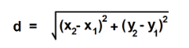

# DISTANCE-BETWEEN-TWO-POINTS

## AIM:
To write a python program to find the distance two 2 points
## ALGORITHM:
### Step 1:  
Import the math module.  
### Step 2:  
Get the first point(x1,y1) and second point(x2,y2) in form of list.  
### Step 3: 
Substitute the values in the distance formula  
  
### Step 4:  
Calculate the distance using the sqrt() function.  
### Step 5:  
Print the result.
### PROGRAM:
```
#Program to find the distance between two points.
#Developed by: ROHIT JAIN D
#RegisterNumber: 212222230120
import math
d1=[4,2]
d2=[10,6]
dist=math.sqrt(((d2[0]-d1[0])**2)+((d2[1]-d1[1])**2))
print("%.2f"%dist)
```
### OUTPUT:
  
### RESULT:
Thus the distance between two points is calculated using python program.
